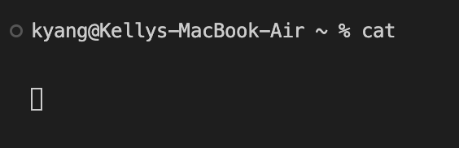

# Lab Report 1
## Using `cd`
1. With**out** arguments
    ```
    kyang@Kellys-MacBook-Air ~ % cd
    kyang@Kellys-MacBook-Air ~ %
    ```
    * **Absolute path**: `/Users/kyang`
    * I got this output because `cd` is meant to change the current working directory. However, I didn't provide a path, so nothing happened.
    * While the output isn't an error, `cd` expects a path to a directory. 

  
2. With path to a **directory** as an argument
   
    * **Absolute path**: `/Users/kyang/lecture1`
    * I got this output because `cd` changes the current working directory to the given path. Everything before the `%` shows that my current working directory is now `lecture1`.
    * This output is not an error. 

3. With a path to a **file** as an argument
   ```
   kyang@Kellys-MacBook-Air lecture1 % cd Hello.java
   cd: not a directory: Hello.java
   ```
   * **Absolute path**: `/Users/kyang/lecture1`
   * I got this output because `cd` is expecting a path to a directory, not a file.
   * This output is an error! This is because `cd` expects a path to a directory, not a file. Since I provided a path to a file, it was unable to change my working directory. 

## Using `ls`
1. With**out** arguments
    ```
    kyang@Kellys-MacBook-Air ~ % ls
    Applications
    Desktop
    Documents
    Downloads
    Library
    Movies
    Music
    Pictures
    Projects
    Public
    Sites
    lecture1
    ```
  
    * **Absolute path**: `/Users/kyang`
    * I got this output because `ls` returns a list of all the folders and files at the current directory if not provided a path.
    * This is not an error.

2. With path to a **directory** as an argument
    ```
    kyang@Kellys-MacBook-Air ~ % ls lecture1
    Hello.class     Hello.java      README          messages
    ```
    * **Absolute path**: `/Users/kyang/lecture1`
    * I got this output because `ls` returns a list of all the folders and files at the path provided.
    * This is not an error.

3. With a path to a **file** as an argument
     ```
     kyang@Kellys-MacBook-Air ~ % ls Hello.java
     ls: Hello.java: No such file or directory
     ```
    * **Absolute path**: `/Users/kyang/lecture1`
    * I got this output because `ls` is expecting a path to a directory, not a file.
    * This output is an error! This is because `ls` expects a path to a directory, not a file. Since I provided a path to a file, it was unable list the folders and files.
  
## Using `cat`
1. With**out** arguments
   
   
   
   * **Absolute path**: `/Users/kyang`
   * I got no output because `cat` is used to print the contents of the file(s) provided. I didn't provide any files, so it reads from standard input.
   * This isn't an error, but `cat` expects one or more paths.
  
2. With path to a **directory** as an argument
   ```
   kyang@Kellys-MacBook-Air ~ % cat lecture1
   cat: lecture1: Is a directory
   ```
   * **Absolute path**: `/Users/kyang`
   * I got this output because `cat` is used to print the contents of the file(s) provided, but I provided a path to a directory instead.
   * This is an error because `cat` expects paths to files, not directories.
    
3. With a path to a **file** as an argument
   ```
   kyang@Kellys-MacBook-Air ~ % cat /Users/kyang/lecture1/messages/en-us.txt
   Hello World!
   ```
   * **Absolute path**: `/Users/kyang`
   * I got this output because `cat` prints out the contents of the file(s) provided. Since I gave it the path to the `en-us.txt` file, it printed out the contents of that file.
   * This is not an error.
