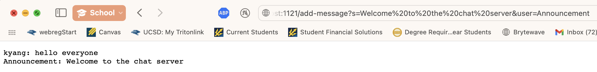

# Lab Report 2
## Part 1 - Web Server `ChatServer`
Code for my `ChatServer`: 
```
import java.io.IOException;
import java.net.URI;

class Handler implements URLHandler {
    String messages = new String();

    public String handleRequest(URI url) {
        if (url.getPath().equals("/")) {
            return String.format("%s", messages.toString());
        } else if (url.getPath().contains("/add-message")) {
            String[] parameters = url.getQuery().split("=");
            int msgEnd = parameters[1].indexOf("&");
            String msgToAdd = parameters[1].substring(0, msgEnd);
            String userMsg = parameters[2] + ": " + msgToAdd + "\n";
            messages = messages + userMsg;
            return String.format("%s", messages);
        } else {
            return "Please use /add-message?s=MESSAGE&user=USER to add a message.";
        }
    }
}

public class ChatServer {
    public static void main(String[] args) throws IOException {
        if(args.length == 0){
            System.out.println("Missing port number! Try any number between 1024 to 49151");
            return;
        }

        int port = Integer.parseInt(args[0]);

        Server.start(port, new Handler());
    }
}
```
<ins>**First Message:**</ins>
 
1. Which methods in your code are called?
    * The `handleRequest` method was called. 
2. What are the relevant arguments to those methods, and the values of any relevant fields of the **class**?
    * 
3. How do the values of any relevant fields of the class change from this specific request? If no values got changed, explain why.
    * 

<ins>**Second Message:**</ins>

1. Which methods in your code are called?
    * 
2. What are the relevant arguments to those methods, and the values of any relevant fields of the **class**?
    * 
3. How do the values of any relevant fields of the class change from this specific request? If no values got changed, explain why.
    * 

## Part 2 - SSH Keys
何何
## Part 3 - Something I Learned
何何
