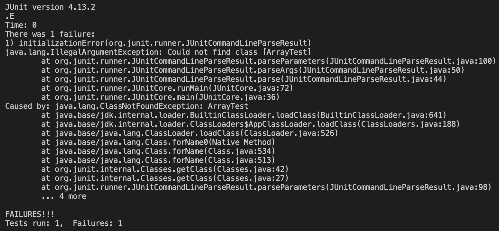

# Lab Report 3
## Part 1 - Bugs
Bug Chosen: issue with `reverse()` method

**1. Failure-inducing input as a JUnit test**
```
  @Test
  public void testReverse3() {
    int[] input = {3, 4, 1};
    assertArrayEquals(new int[] {1, 4, 3}, ArrayExamples.reversed(input));
  }
```
**2. Input that *doesn't* induce failure as a JUnit test**
```
  @Test
  public void testReversed() {
    int[] input1 = { };
    assertArrayEquals(new int[]{ }, ArrayExamples.reversed(input1));
  }
```
**3. Symptom**


**4. Bug: Before & After**

  Before:
  ```
  static int[] reversed(int[] arr) {
      int[] newArray = new int[arr.length];
      for(int i = 0; i < arr.length; i += 1) {
        arr[i] = newArray[arr.length - i - 1];
      }
      return arr;
  }
  ```
  After:
  ```
  static int[] reversed(int[] arr) {
      int[] newArray = new int[arr.length];
      for(int i = 0; i < arr.length; i += 1) {
        newArray[i] = arr[arr.length - i - 1];
      }
      return newArray;
  }
  ```
**5. Fix description**

This fix addresses the issue because in the old code, it was re-assigning the indexes in `arr` to values in `newArray`. However, all the indexes in `newArray` have no values in them, so the method was originally clearing out `arr` and returning it. The fix changes this by assigning values from `arr` to `newArray` backwards and returns `newArray`. 

## Part 2 - Researching Commands
**Command chosen:** `find`

1. `-name` option
2. `-type` option
3. `-size` option
4. `-daystart` option
