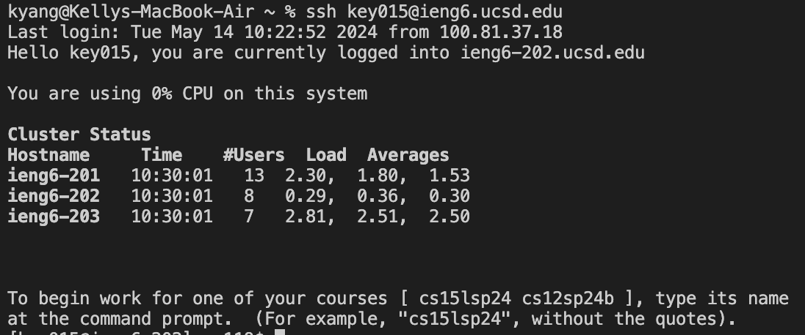
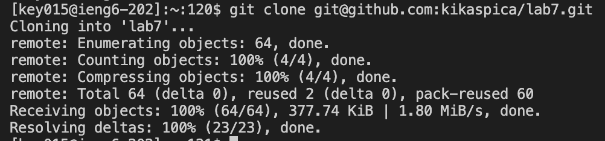
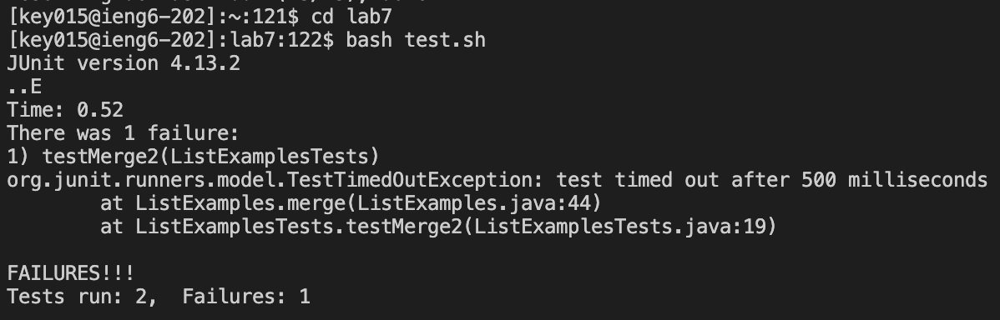
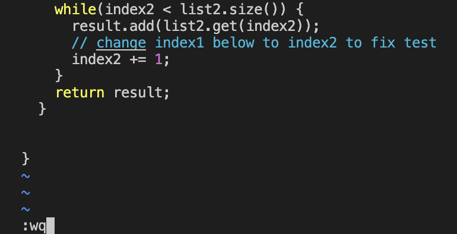
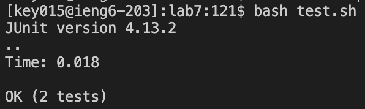
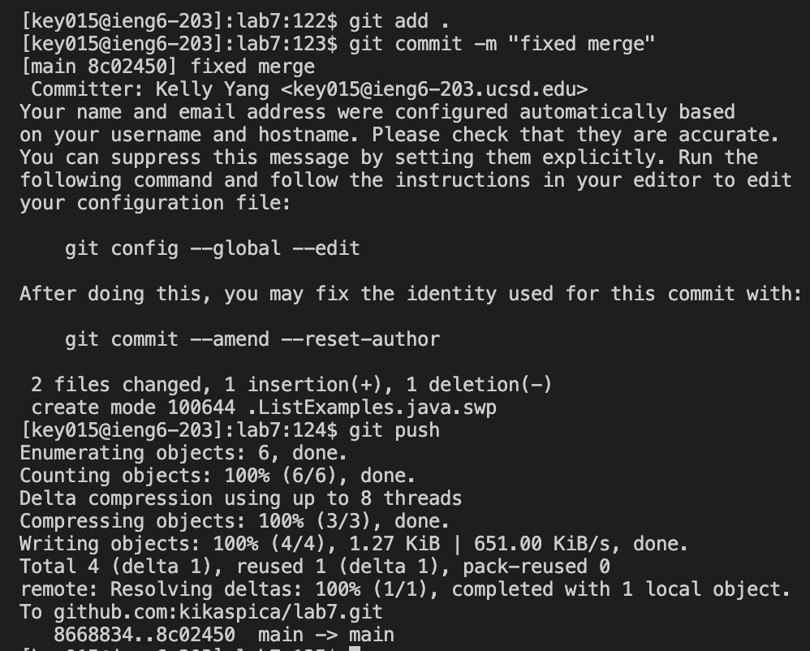

# Lab Report 4
## Step 4 - Log into ieng6
 
I typed in `ssh <space> key015@ieng6.ucsd.edu` and then pressed `<enter>` to log into my ieng6 account.

## Step 5 - Clone your fork of the repository from your Github account
 

I typed in `git <space> clone <space> git@github.com:kikaspica/lab7.git` and then pressed `<enter>` to clone my fork of the lab7 repository. 

## Step 6 - Run the tests, demonstrating that they fail
 

I first typed in `cd <space> lab7` and `<enter>` to move into the `lab7` directory. I then typed in `bash <space> test.sh` and hit `<enter>` to run the tests.

## Step 7 - Edit the code file to fix the failing test
 
 

I first typed in `vim <space> List`, hit `<tab>` to autofill in `Examples` after `List`, and then finally typed `.java` and `<enter>`. 
I pressed `<shift> + g` to move to the bottom of the file, and then pressed `kkkkkkwlllll` to move my cursor above the 1 in `index1`. The k's moved my cursor up, the w moved my cursor to the beginning of the first word (`index1`), and the l's moved my cursor right to the 1. 
I then pressed `r` and then `2` to replace the 1 with a 2. Finally, I typed in `:wq` and `<enter>` to save my changes and exit vim. 

## Step 8 - Run the tests, demonstrating that they now succeed

I typed in `bash <space> test.sh` and hit `<enter>` to run the tests.

## Step 9 - Commit and push the resulting change to your Github account

I first typed in `git <space> add .` and `<enter>` to stage all modified files ready for commit. I then typed in `git <space> commit <space> -m <space> "fixed merge"` and `<enter>` to commit my changes with the message "fixed merge". Finally, I typed `git <space> push` and `<enter>` to push the changes to my Github account.
