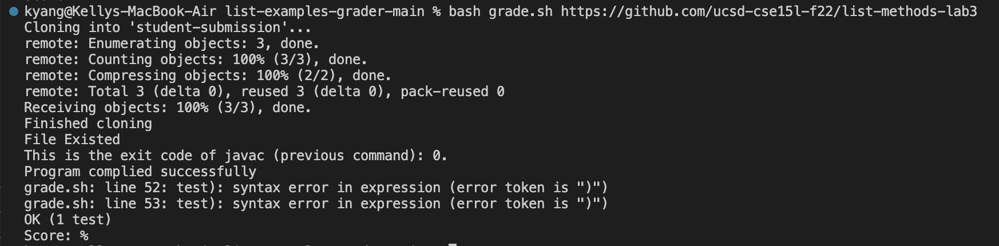

# Lab Report 5
## Part 1 - Debugging Scenario
### Original Post
When I run my grade.sh, I get this error. 

Command Ran: `bash grade.sh https://github.com/ucsd-cse15l-f22/list-methods-lab3`
 

Here is my file and directory structure:

 

My `grade.sh` file is written as such (BEFORE DEBUG):
```
CPATH='.:lib/hamcrest-core-1.3.jar:lib/junit-4.13.2.jar'

rm -rf student-submission
rm -rf grading-area

mkdir grading-area

git clone $1 student-submission
echo 'Finished cloning'

# Step 2 -- Check that the student code contains ListExamples.java
if [[ -f student-submission/ListExamples.java ]]; then
    echo "File Existed"
else
    echo "ListExamples.java does not exist"
    echo "Grade: 0"
    exit 1
fi

# Step 3 -- Put all the relevant files in the grading-area directory
cp student-submission/ListExamples.java TestListExamples.java grading-area
cp -r lib grading-area

# Step 4 -- Compile the java files and check that they compiled successfully
cd grading-area
javac -cp $CPATH ListExamples.java TestListExamples.java

echo "This is the exit code of javac (previous command): $?."


# Draw a picture/take notes on the directory structure that's set up after
# getting to this point

# Then, add here code to compile and run, and do any post-processing of the
# tests

if [ $? -ne 0 ] 
then
    echo "Compilation error!"
    exit 1
fi


echo "Program complied successfully"


java -cp $CPATH org.junit.runner.JUnitCore TestListExamples > junit-output.txt

outputLast=$(cat junit-output.txt | tail -n 2 | head -n 1)
tests=$(echo $outputLast | awk -F'[, ]' '{print $3}')
fail=$(echo $outputLast | awk -F'[, ]' '{print $6}')
success=$((tests - fail))
score=$((success/tests))

echo $outputLast
echo "Score: $score%"
```

And my code for `TestListExamples.java` is as follows (BEFORE DEBUG):
```
import static org.junit.Assert.*;
import org.junit.*;
import java.util.Arrays;
import java.util.List;

class IsMoon implements StringChecker {
  public boolean checkString(String s) {
    return s.equalsIgnoreCase("moon");
  }
}

public class TestListExamples {
  @Test
  public void testSimpleFilter() {
    StringChecker checker = new IsMoon();
    List<String> input = Arrays.asList("hello", "MOON", "hey", "moonnnn");
    List<String> expected = Arrays.asList("MOON");
    assertEquals(expected, ListExamples.filter(input, checker));
  }
}
```
The student submission I used to run with `grade.sh` should be passing this test and it should have a score of 100%.

### TA Response
Hello! Looking at the error message you're getting, it seems the problem is in lines 52 and 53 where you declare your `success` and `score` variables. Try using `echo` around those two lines to see the values of the variables you're using in those lines. One of the variables you're using might not be initialized.

### Debugged Response
Thank you! I figured out that my `fail` variable was not initialized when all the tests passed by using `echo`.
 

I fixed this by creating an if statement that checks if `fail` is null. If it's null, then that means all the tests passed and the script now returns the proper message. Otherwise, the operates the same as before, calculating the score by dividing successes by failures. 
 

## Part 2 - Reflection
Something I learned from my lab experience was how to write my own bash scripts. The syntax is a little confusing and finicky, and it's hard to remember how to do all the things I want to do, but overall I think it's cool and interesting to be able to write a script and run it in the terminal. It saves a lot of time when there's a sequence of terminal commands that you want to run with different arguments! I also learned how to use vim. I think it's really cool how everything in vim can be done with just the keyboard!
